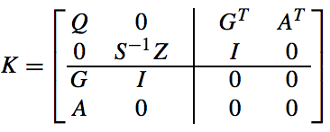
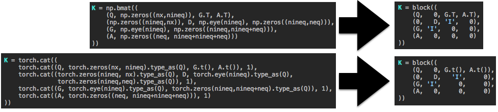

# Block • [![License][license-image]][license] [![PyPi][pypi-image]][pypi]

[license-image]: http://img.shields.io/badge/license-Apache--2-blue.svg?style=flat
[license]: LICENSE

[pypi-image]: https://img.shields.io/pypi/v/block.svg
[pypi]: https://pypi.python.org/pypi/block

*An intelligent block matrix library for numpy, PyTorch, and beyond.
Crafted by [Brandon Amos](http://bamos.github.io) with significant
contributions by [Eric Wong](http://www.cs.cmu.edu/~ericwong/).*

---

## Why do we need an intelligent block matrix library?

Let's try to construct the KKT matrix from Mattingley and Boyd's
[CVXGEN](http://stanford.edu/~boyd/papers/pdf/code_gen_impl.pdf)
paper in numpy and PyTorch:



Without `block`, there is no way to infer the appropriate sizes of
the zero and identity matrix blocks.
It is an inconvenience to think about what size these
matrices should be.



## What does `block` do?

Block acts a lot like `np.bmat` and replaces:

+ Any constant with an appropriately shaped block matrix
  filled with that constant.
+ The string `'I'` with an appropriately shaped identity matrix.
+ The string `'-I'` with an appropriately shaped negated identity matrix.
+ [[Request more features.]](https://github.com/bamos/block/issues)


## Isn't constructing large block matrices with a lot of zeros inefficient?

Yes, `block` is meant to be a quick prototyping tool and
there's probably a more efficient way to solve your system
if it has a lot of zeros or identity elements.

## How does `block` handle numpy and PyTorch with the same interface?

I wrote the logic to handle matrix sizing to be agnostic
of the matrix library being used.
numpy and PyTorch are just backends.
More backends can easily be added for your favorite
Python matrix library.

```Python
class Backend(metaclass=ABCMeta):

    @abstractmethod
    def extract_shape(self, x): pass

    @abstractmethod
    def build_eye(self, n): pass

    @abstractmethod
    def build_full(self, shape, fill_val): pass

    @abstractmethod
    def build(self, rows): pass

    @abstractmethod
    def is_complete(self, rows): pass
```

# Getting Started

+ Install: `pip install block`
+ Usage: `from block import block`
+ Run tests in `test.py`: `nosetests test.py`

# Issues and Contributions

I'd be happy to hear from you about any issues or features you
add, please [file an issue](https://github.com/bamos/block/issues)
or [send in a PR](https://github.com/bamos/block/pulls).

# Licensing

This repository is
[Apache-licensed](https://github.com/bamos/block/blob/master/LICENSE).
