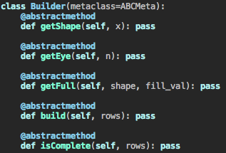

# Block • [ ![Build Status] [travis-image] ] [travis] [ ![License] [license-image] ] [license]

*An intelligent block matrix library for numpy, Torch, and beyond.*

[travis-image]: https://travis-ci.org/bamos/block.png?branch=master
[travis]: http://travis-ci.org/bamos/block

[license-image]: http://img.shields.io/badge/license-Apache--2-blue.svg?style=flat
[license]: LICENSE

---

## Why do we need an intelligent block matrix library?

Let's try to construct the KKT matrix from Mattingley and Boyd's
[CVXGEN](http://stanford.edu/~boyd/papers/pdf/code_gen_impl.pdf)
paper in numpy and PyTorch:

Without `block`, there is no way to infer the appropriate sizes of
the zero and identity matrix blocks.

# Getting Started

+ Install: `pip install block`
+ Usage: `from block import block`
+ Run tests in `test.py`: `nosetests test.py`

# Isn't constructing large block matrices with a lot of zeros inefficient?

Yes, `block` is meant to be a quick prototyping tool and
there's probably a more efficient way to solve your system
if it has a lot of zeros or identity elements.

# What does `block` replace?

+ Any constant with an appropriately shaped block matrix.
+ The string `'I'` with an appropriately shaped identity matrix.
+ [Request more features](https://github.com/bamos/block/issues).

# How does `block` handle numpy and PyTorch with the same interface?

I wrote the logic to handle matrix sizing to be agnostic
of the matrix library being used.
numpy and PyTorch are just backends.
More backends can easily be added for your favorite
Python matrix library.

# Issues and Contributions

I'd be happy to hear from you about any issues or features you
add, please [file an issue](https://github.com/bamos/block/issues)
or [send in a PR](https://github.com/bamos/block/pulls).

# Licensing

This repository is
[Apache-licensed](https://github.com/bamos/block/blob/master/LICENSE).
